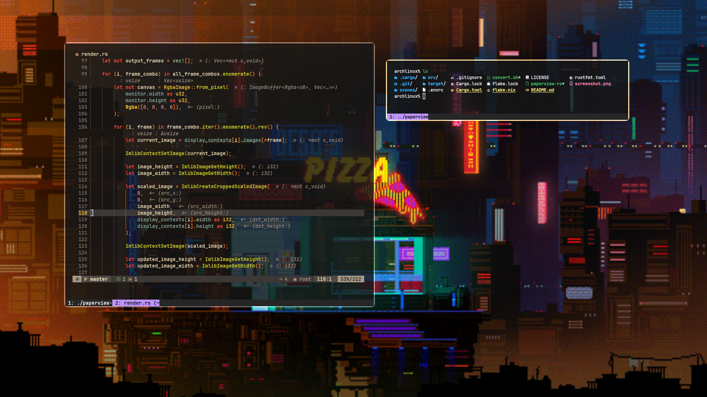

# PAPERVIEW-RS

Paperview rewrite in rust with compositor support



<h2> Table of Contents </h2>

- [Prerequisites](#prerequisites)
- [Quick Start](#quick-start)
    - [Installation](#installation)
    - [Single Monitor Use](#single-monitor-use)
    - [Multi Monitor Use](#multi-monitor-use)
    - [Running as a Background Process](#running-as-a-background-process)
    - [Custom Scenes](#creating-custom-scenes)
- [License](#license)


## Prerequisites
- [ImLib2.h](https://github.com/lluixhi/imlib2/tree/master)
- [LibXrandr](https://www.x.org/wiki/libraries/libxrandr/)
- [Clang](https://clang.llvm.org/)
- [Cargo](https://www.rust-lang.org/tools/install)

## Quick Start

### Installation

Clone the repository:
```bash
    git clone https://github.com/eatmynerds/paperview-rs.git
    cd paperview-rs
    cargo build --release
    mv target/release/paperview-rs .
```

## Single Monitor Use

paperview-rs can handle a single monitor like so:
```bash
    ./paperview-rs --bg "<monitor width>:<monitor height>:<monitor x offset>:<monitor y offset>:<bitmap-directory>:<fps>"
```

## Multi Monitor Use

paperview-rs can handle any number of monitors. Each monitor will render wallpapers independently.
```bash
    ./paperview-rs --bg "<monitor width>:<monitor height>:<monitor x offset>:<monitor y offset>:<bitmap-directory>:<fps>" --bg "<monitor width>:<monitor height>:<montior x offset>:<monitor y offset>:<bitmap-directory>:<fps>"
```


## Running as a Background Process

Run paperview-rs in the backgrond using `&`:
```bash
    ./paperview-rs --bg "<montior width>:<monitor height>:<monitor x offset>:<monitor y offset>:<bitmap-directory>:<fps>" &
```

To terminate the background process:
```bash
    killall paperview-rs
```

## Creating Custom Scenes

Creating a custom BMP scene folder from a GIF requires imagemagick.
For example, to create a castle scene folder from a castle.gif:
```bash
./convert.sh castle.gif castle-bmp
```

## Random Animated Wallpapers at Startup

Assuming a scenes folder containing a number of scene folders is present in the home folder,
run the following snippet as a background process within .xinitrc before running `startx`,
or simply execute it after X11 is running:
```bash
#!/bin/sh

while true; do
    scene=$(ls -d $HOME/repos/paperview-rs/scenes/* | shuf -n 1)

    timeout 600 ./paperview-rs --bg "1920:1080:0:0:${scene}:60"
done
```


## License
Licensed under [MIT](./LICENSE).
